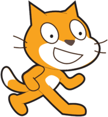
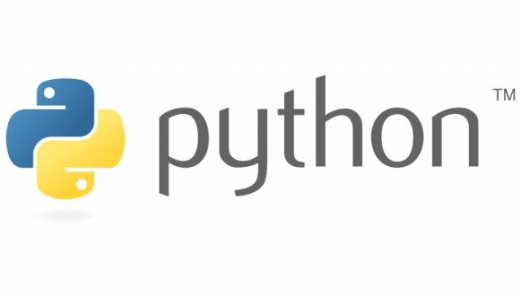
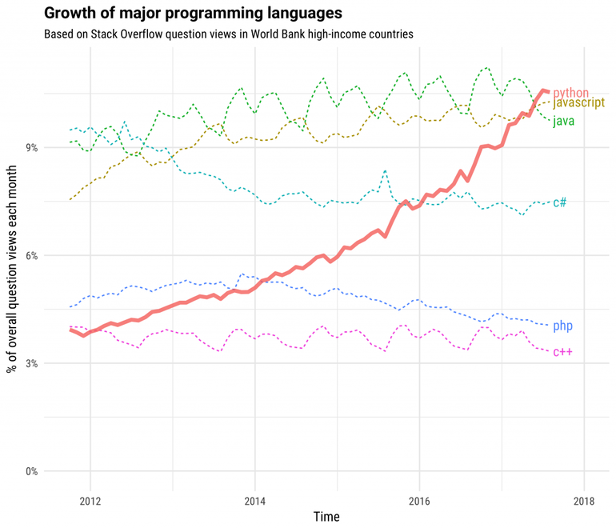

# pythonを使ってゲームを作ろう！！


## 今日作るゲーム：石取りゲーム

### ルール


１５個の石を順番に取っていきます。取ることのできる石の数は、「１個」か「２個」しか選べません。

最後の一個を取ったら、負けです。**最後の一個を取らないようにする**ゲームです。


<input id="startBtn" type="button" value="スタート"  style="display:block;" onClick="gameStart()"/>
<div id="stoneGame" style="display:none;">
<p id="stones">〇〇〇〇〇〇〇〇〇〇〇〇〇〇〇</p>

<input id="oneBtn" type="button" value="１個" onClick="getOne()" />
<input id="twoBtn" type="button" value="２個" onClick="getTwo()" />

<p id="stoneMsg"></p>
<p id="stoneMsgCp"></p>

</div>

<p id="gameResult"></p>

<script>
var stoneNum = 15;

function gameStart(){
    var stoneGame = document.getElementById("stoneGame");
    var startBtn = document.getElementById("startBtn");
    stoneGame.style.display = "block";
    startBtn.style.display = "none";
    stoneNum = 15;
    var gameResult = document.getElementById("gameResult");
    gameResult.innerText = "";
    setStone(15, false);
}

function gameEnd(isLose){
    var stoneGame = document.getElementById("stoneGame");
    var startBtn = document.getElementById("startBtn");
    stoneGame.style.display = "none";
    startBtn.style.display = "block";
    startBtn.value = "もう一度";
    var gameResult = document.getElementById("gameResult");
    if(isLose){
        gameResult.innerText = "あなたの負け";
    }else{
        gameResult.innerText = "あなたの勝ち";        
    }
}

function setStone(num, isUser){
    var stone ="";
    for(var i=0; i < num;i++){
        stone = stone + "〇";
    }
    if(num <= 0){
        gameEnd(isUser);
    }
    var stones = document.getElementById("stones");
    stones.innerText = stone;
}

function getOne(){
    getUser(1);
    changeBtn(true);
    if(stone <= 0)
        return;
    setTimeout("getCp(2)", 1000);
}

function getTwo(){
    getUser(2);
    changeBtn(true);
    if(stone <= 0)
        return;
    setTimeout("getCp(1)", 1000);
}

function getUser(userNum){
    stoneNum = stoneNum - userNum;
    setStone(stoneNum, true);
    var msgcp = document.getElementById("stoneMsgCp");
    msgcp.innerText ="";
    var msg = document.getElementById("stoneMsg");
    msg.innerText = "あなたは" + userNum + "個取りました。";
}

function getCp(cpNum){

    if(stoneNum == 3){
        cpNum = 2;
    }else if(stoneNum == 2){
        cpNum = 1;
    }
    
    var msgcp = document.getElementById("stoneMsgCp");
    stoneNum = stoneNum - cpNum;
    setStone(stoneNum, false);
    msgcp.innerText = "コンピュータは" + cpNum + "個とりました。";
    changeBtn(false);    
}

function changeBtn(doDisable){
    var oneBtn = document.getElementById("oneBtn");
    var twoBtn = document.getElementById("twoBtn");
    oneBtn.disabled = false;
    twoBtn.disabled = false;
}

</script>


<hr/>
<br/>
<br/>


# Lesson0 はじめに
## プログラミングとは？


**プログラム** = 「**命令**」

<br/>
<br/>

 
 
命令：「右へ１０歩動く」

<br/>




<br/>
<br/>
 
 
命令：「左へ１０歩動く」

<br/>


<br/>
<br/>
<br/>


プログラミングとは...

**コンピュータへ命令を作ること**です!!


<hr/>
<br/>
<br/>
<br/>


## pythonとは？




pythonは、プログラムを作ることができるプログラミング言語(コンピュータが理解できる言語)の一種です。


- python言語は、

「**誰が書いても綺麗なプログラムになるように作られた言語**」


- シンプル
- 見やすい


## なぜpythonが注目されているか？


- 人気急上昇



- 豊富なライブラリ


<hr/>
<br/>
<br/>


## 環境構築


python講座で使用するツールをインストールしましょう！
使うものは、以下のものです。


- python　（バージョン３のもの）
- pythonを動かすアプリケーション

<br/>
<br/>


## python バージョン3

pythonは多くのOSでは、すでにインストールされている場合が多いですが、多くの場合は、python 2.X.Xのバージョンであることが多いです。

python2.X.Xのバージョンとpython3.X.Xのバージョンは、異なる部分がとても多いです。

本講義では、python3.X.X を使用するので、下記のURLからダウンロードして、インストールまで行いましょう。


[https¥://www.python.org/downloads/](https://www.python.org/downloads/)


<br/>
<br/>


## pythonを動かすアプリケーション

続いて、pythonを動かすアプリケーションをインストールします。


基本的には、文字が書けるアプリケーション（Visual studio code, さくらエディタなど）なら、大丈夫です。


もし、今日をきっかけに勉強してみたいという人へのオススメは、PyCharmです。


PyCharmをインストールする方は、こちらからどうぞ


[https¥://www.jetbrains.com/pycharm/](https://www.jetbrains.com/pycharm/
)


環境構築が終わったら、いよいよプログラムを書いていきましょう！！！


※テキストエディタによっては、コマンドラインの機能がないものもありますので、Terminal(Mac),コマンドプロンプト(windows)が必要な場合もございます。


<hr/>
<br/>
<br/>
<br/>


# Lesson1 出力しよう！


## Hello World

まずは、最初のプログラムの定番、「Hello World!!」と出力してみます。


### まずは、ファイルを作ってみましょう！


pythonのファイルは、


```python
xxxxx.py
```


というファイル名で作ることができます。


ファイル名に「.py」が付いていれば、全部pythonのプログラムです。


今回は、


```python
lesson1.py
```

という名前で作成しましょう。

<br/>
<br/>


## Hello Wolrd!!のプログラムを作ろう

それでは、作成したファイルに、以下のプログラムを書いていきましょう。


```python
print("Hello world!!")
```

<br/>
<br/>

### 作ったプログラムを実行しよう！


ファイルを実行する時は、以下のように入力して、実行します。


```python
python xxxxx(ファイル名).py
```

今回の場合は、

```python
python lesson1.py
```

と入力します。

<br/>
<br/>


## print文の様々な書き方

「" "」の他にも「' '」を使っても良い。

いずれかに囲まれた物を表示します。


```python
print('Hello world!!')
```


<br/>
<br/>

<div class="enshu">
    <p class="enshu-title">演習：</p>
    <p class="enshu-q">
        lesson1.pyを編集して、好きな文字を出力してみよう！！
    </p>
</div>


<br/>
<br/>


<div class="enshu">
    <p class="enshu-title-next">演習(早く終わった人)：</p>
    <p class="enshu-q">
        ①「Let's enjoy programing!!」と出力してみましょう。
    </p>
    <br/>
    <p class="enshu-q">
        ②「I am "HERO".」と出力してみましょう。
    </p>
</div>


<hr/>
<br/>
<br/>


# Lesson2 変数


lesson2.pyのファイルを作りましょう！


## 変数

変数とは、値が変化する数のことです。


例えば、以下のプログラムは、aという変数に10を入れるという意味です。


```python
a = 10
```

<br/>
<br/>

#### 本当に入っているか確認してみよう！！


新しいファイルlesson2.pyにコピーして、以下のプログラムを実行させてみよう。


```python
a = 10

print(a)
```

### ◼変数の特徴その①：変数は値が変化する

ファイルlesson2.pyにコピーして、以下のプログラムを実行させてみよう。

```python
a = 10
a = 20

print(a)
```

※上書きされます。

<br/>
<br/>


### ◼変数の特徴その②：変数はいくつも作れる！文字も入れることができる!

ファイルlesson2.pyにコピーして、以下のプログラムを実行させてみよう。


```python
a = 10
b = 20
c = "hello"

print(a)
print(b)
print(c)
```

<br/>
<br/>


次のプログラムを動かして見て出力結果を見てみましょう。

```python

a = 10
b = 20
c = "hello"

a = b

print(a)
print(b)
print(c)

```


<br/>
<br/>

**「a = b」は、aにbの値を入れるという意味になります。**

<br/>
<br/>


つまり、「**右のものを左に入れる**」という意味になります。


<br/>
<br/>


<div class="enshu">
    <p class="enshu-title">演習：</p>
    <p class="enshu-q">
    次のプログラムの出力結果が何になるか答えなさい
    <pre style="background-color: #364549;color:#ffffff;margin: 5px;">
    a = 10
    b = 20

    c = a
    a = b
    b = c

    print(a)
    </pre>

   </p>
   <div class="enshu-a">
       <p class="enshu-a-title">回答</p>
       <input type="text" size="10" />
   </div>
</div>


<div class="enshu">
    <p class="enshu-title">演習：</p>
    <p class="enshu-q">
    次のプログラムの出力結果が何になるか答えなさい。
    <pre style="background-color: #364549;color:#ffffff;margin: 5px;">

    a = 'おはよう'
    b = 'こんにちは'
    c = 'こんばんは'

    d = a
    a = b
    b = c
    c = d

    print(c)

    </pre>

   </p>
   <div class="enshu-a">
       <p class="enshu-a-title">回答</p>
       <input type="text" size="10" />
   </div>
</div>


<hr/>
<br/>
<br/>


# Lesson3 型

lesson3.pyを作ろう！

## 型

プログラムは、数字と文字を別々に識別しています。


下のプログラムは、numには「１０」が入っています。


```python
num = "10"
```

この「10」は、文字でしょうか？数字でしょうか？


答えは、以下のプログラムを動かしてみましょう。

### lesson3.pyにコピーして実行してみよう！


```python
num = "10"

print(num)
print(type(num))
```


以下のように表示されます。


```python
10
<class 'str'>
```

<br/>
<br/>

**<class 'str'>**と表示れたら、「**文字**」であるという意味になります。


<br/>
<br/>


### lesson3.pyを以下のように書き換えて、もう一度実行してみましょう。


```python
num = 10

print(num)
print(type(num))
```

今度は、以下のように表示れました。


```python
10
<class 'int'>
```

<br/>
<br/>

**<class 'int'>**と表示れたら、「**数字**」であるという意味になります。

<br/>
<br/>


## 覚えること

|型| |
| str | 文字 |
| int | 数字 |


<br/>
<br/>


<div class="enshu">
    <p class="enshu-title">演習：</p>
    <p class="enshu-q">
    次の変数aとbの型を調べてみよう。（lesson3.pyにコピーして、プログラムを書きましょう。）
    <pre style="background-color: #364549;color:#ffffff;margin: 5px;">

    a = "100"
    b = 100

    </pre>
   </p>
</div>


<hr/>
<br/>
<br/>


#Lesson4 演算

lesson4.pyを作りましょう。

## 演算

演算とは、+,-,×,÷をすることです。

<br/>
<br/>


例えば、プログラムで書くと以下のように書くことができます。

lesson4.pyにコピーして実行してみよう。

```python
a = 10
b = 7
print(a + b)
```
<br/>
<br/>

### その他の計算


```python
a = 10
b = 7

print(a + b) #足し算
print(a - b) #引き算
print(a * b) #かけ算
print(a / b) #割り算
print(a % b) #剰余（割り算の余り）
print(a ^ b) #べき乗
```

<br/>
<br/>
<br/>


<div class="enshu">
    <p class="enshu-title">演習：</p>
    <p class="enshu-q">
    全部の記号をキーボードで押せるかな？
   </p>
   <div class="enshu-a">
       <p class="enshu-a-title">回答</p>
        足し算の記号：<input type="text" size="3" /><br/>

        引き算の記号：<input type="text" size="3" /><br/>

        かけ算の記号：<input type="text" size="3" /><br/>

        割り算の記号：<input type="text" size="3" /><br/>

        剰余の記号：<input type="text" size="3" /><br/>

        べき乗の記号：<input type="text" size="3" /><br/>
   </div>
</div>


<br/>
<br/>
<br/>


### 文字の足し算もできます。

lesson4.pyの一番下の行に追加してみよう。

```python
print("おはよう" + "ございます。")
```

<br/>
<br/>
<br/>


<div class="enshu">
    <p class="enshu-title">演習：</p>
    <p class="enshu-q">
    それぞれどんな結果になるでしょうか？
    <pre style="background-color: #364549;color:#ffffff;margin: 5px;">

    a = 10
    b = 7

    c = a + 1
    d = b -1

    print(c)
    print(d)

    </pre>

   </p>
   <div class="enshu-a">
       <p class="enshu-a-title">回答</p>
        print(c):<input type="text" size="3" /><br/>
        print(d):<input type="text" size="3" /><br/>
   </div>
</div>


<br/>
<br/>
<br/>


```python
a = 10

a = a + 1

print(a)
```

どんな結果になるでしょうか？

<input type="text" size="3" />


<br/>
<br/>
<br/>


```python
b = 7

b = b - 1

print(a)
```

どんな結果になるでしょうか？

<input type="text" size="3" />


<br/>
<br/>
<br/>


```python
print(2 + 3 * 5)
```

どんな結果になるでしょうか？

<input type="text" size="3" />


<hr/>
<br/>
<br/>

# Lesson5 入力しよう！

lesson5.pyを作りましょう！

<br/>
<br/>

## 入力

printで値を出力しましたが、入力する方法を学びます。

入力の書き方は、


```python
変数名 = input("メッセージ")
```

<br/>
<br/>

試しに、lesson5.pyに以下のプログラムを書いて、実行してみましょう。


```python
s = input("何か入力してください。：")

print("入力された値を表示します。")
print(s)
```

<br/>
<br/>

<div class="enshu">
    <p class="enshu-title">演習：</p>
    <p class="enshu-q">
    「あなたの名前を入力してください。：」と入力するように促しましょう。(lesson5.pyを編集)
    また、入力された名前に対して、「〇〇さん、ありがとうございます。」と出力しましょう。
    </p>

</div>

<hr/>
<br/>
<br/>


# Lesson6 if文

lesson6.pyを作りましょう。


## if文
ここからは、条件分岐について学んでいきます。

<br/>


例えば、テストの点数が、100点の時は、「満点」と表示したい時は？(lesson6.pyにコピーして実行してみよう！)


```python
test = 100


if test == 100:
    print('満点')
```

<br/>
<br/>

このように、　「==」 は左と右が同じという意味になります。


これを**比較演算子**と呼びます。

<br/>
<br/>


その他の比較演算子は以下のようなものがあります。


| 記号 | 使用例 | 意味 |
| == | A == B | AとBは、等しい  | 
| > | A > B | Aは、Bより大きい  | 
| >= | A >= B | Aは、B以上  | 
| < | A < B | Aは、Bより小さい(未満)  | 
| <= | A <= B | Aは、B以下  | 
| != | A != B | AとBは、等しくない  | 


<br/>
<br/>
<br/>


<div class="enshu">
    <p class="enshu-title">演習：</p>
    <p class="enshu-q">
    次のif文の「条件式」が、（１）から（３）の時に、成り立つ場合は、「True」。成り立たない場合は、「False」を選びなさい。
    <pre style="background-color: #364549;color:#ffffff;margin: 5px;">
    (1)
    a = 70
    
    if a > 50: 
        print('True')
    </pre>
    <pre style="background-color: #364549;color:#ffffff;margin: 5px;">
    (2)
    b = 50
    if b > 50:
        print('True')
    </pre>
    <pre style="background-color: #364549;color:#ffffff;margin: 5px;">
    (3)
    c = 30
    if c > 50:
        print('True')
    </pre>
    <pre style="background-color: #364549;color:#ffffff;margin: 5px;">
    (4)
    d = 50
    if d != 50:
        print('True')
    </pre>
   </p>
   <div class="enshu-a">
       <p class="enshu-a-title">回答</p>
        (1):<input type="text" size="3" /><br/>
        (2):<input type="text" size="3" /><br/>
        (3):^.<input type="text" size="3" /><br/>
        (4):<input type="text" size="3" /><br/>
   </div>
</div>


## else文
続いて、テストの点数が、70点以上は「True」。70点未満は「False」と表示したい時は？(lesson6.pyにコピーして実行してみよう！)


```python
test = 70


if test >= 70:
    print('True')
else:
    print('False')
```


<br/>
<br/>
<br/>


## elif文
最後に、80点以上は「A」、60点以上は、「B」、それ以外は、「C」と表示したい時は？(lesson6.pyにコピーして実行してみよう！)


```python
test = 60


if test >= 80:
    print('A')
elif test >= 60:
    print('B')
else:
    print('C')
```


<br/>
<br/>
<br/>

<div class="enshu">
    <p class="enshu-title">演習：</p>
    <p class="enshu-q">
    lesson6.pyのプログラムを編集して、以下のようなプログラムを作成しましょう。
    timeが10より小さい場合は、「おはよう」と出力。
    timeが17より小さい場合は、「こんにちは」と出力。
    それ以外の場合は、「こんばんは」と出力。
    <pre style="background-color: #364549;color:#ffffff;margin: 5px;">
    time = 15

    if ここに条件を記載:
        print(ここに処理を記載)
    elif ここに条件を記載:
        print(ここに処理を記載)
    else:
        print(ここに処理を記載)
    </pre>
    </p>
</div>


<div class="enshu">
    <p class="enshu-title-next">時間余った人演習：</p>
    <p class="enshu-q">
    以下のような条件の処理をするように、lesson6.pyを書き換えましょう。
    dayの値を7で割った余りが0の場合は、「日曜日」
    dayの値を7で割った余りが1の場合は、「月曜日」
    dayの値を7で割った余りが2の場合は、「火曜日」
    dayの値を7で割った余りが3の場合は、「水曜日」
    dayの値を7で割った余りが4の場合は、「木曜日」
    dayの値を7で割った余りが5の場合は、「金曜日」
    dayの値を7で割った余りが6の場合は、「土曜日」
    <pre style="background-color: #364549;color:#ffffff;margin: 5px;">
    day = 15

    ここにif文の処理を書いてください。

    </pre>
    </p>
</div>


<hr/>
<br/>
<br/>


# Lesson7 for文

lesson7.pyを作りましょう。

## for文の書き方１

例えば、0から9までの数字を表示したい時は？

<br/>


```python
print(0)
print(1)
print(2)
print(3)
print(4)
print(5)
print(6)
print(7)
print(8)
print(9)
```

<br/>
<br/>

って書くの大変ですよね...。（ちょっとカッコ悪い）

<br/>
<br/>

そこで、for文の出番です。


同じ処理をする場合は、何回その処理をやるのか書くだけで、繰り返し処理をしてくれます。

lesson7.pyへ下のプログラムをコピーして実行してみよう。


```python
for i in range(10):
    print(i)
```


<br/>
<br/>


<div class="enshu">
    <p class="enshu-title">演習：</p>
    <p class="enshu-q">
    lesson7.pyのfor文を使って、0から30まで出力しましょう。
    </p>
</div>

<div class="enshu">
    <p class="enshu-title-next">早く終わった人の演習：</p>
    <p class="enshu-q">
    lesson7.pyのfor文を使って、0から30まで出力しましょう。
    また、その時に、3の倍数のみを表示するようにしてください。
    </p>
</div>

<div class="enshu">
    <p class="enshu-title-next">早く終わった人の演習：</p>
    <p class="enshu-q">
    lesson7.pyのfor文を使って、30から0まで出力しましょう。
    </p>
</div>


<hr/>
<br/>
<br/>

## while文

```python
while 繰り返す条件:


```

<br/>
<br/>


lesson7.pyに追記しましょう。

```python
num = 10

while num > 0:
    num = num -1
    print(num)
```

<br/>
<br/>


lesson7.pyに追記しましょう。

途中で処理を止めたいときは、if文とbreakを使おう。


```python
num = 10

while num > 0:
    num = num -1
    print(num)
    
    if num == 3:
        break
```


# Lesson8 関数
lesson8.pyを作成しましょう。

<br/>

## 関数の作り方

関数は、同じ処理を何回も使いたい時に、処理をまとめておくことで便利に使えます。

例えば、じゃんけんをするプログラムを書くときに、下記のような処理を出力します。

```python
print('じゃんけん')
print('ぽい')
```


その時に、例えば３回勝負るすと...


```python
print('じゃんけん')
print('ぽい')

print('じゃんけん')
print('ぽい')


print('じゃんけん')
print('ぽい')
```

のように、なるのはちょっと不便ですよね。


そんな時に、役立つのが、関数です。


関数は、処理を一つにまとめてくれるとても便利なものです。

以下のない表をlesson8.pyにコピーしましょう。


```python
def janken():
    print('じゃんけん')
    print('ぽい')

janken()
janken()
janken()
```


<br/>
<br/>

## 引数

引数とは、関数に変数を渡すことができる便利なものです。

以下のない表をlesson8.pyの下に追記しましょう。


```python
def ohayo(name):
    print(name + 'さん、おはよう。')

ohayo('田中')
ohayo('中山')
ohayo('山田')
```


<hr/>
<br/>
<br/>


## 戻り値

戻り値とは、関数が呼び出された後に、結果を返すことができます。

以下のない表をlesson8.pyの下に追記しましょう。


```python
def bai(num):
    return num * 2

a = 5
b = 1000

print(bai(a))
print(bai(b))
```


<div class="enshu">
    <p class="enshu-title">演習：</p>
    <p class="enshu-q">
    lesson8.pyの下に以下の処理を追記しましょう。
    (1)関数名がhelloという関数：
      「おはよう」と出力をする処理を書く。
    (2)関数名がthankという関数：
       引数nameを持ち、戻り値「nameさん、ありがとう」を返す。
    <pre style="background-color: #364549;color:#ffffff;margin: 5px;">
    # ここに関数（１）の処理を書く。

    # ここに関数（２）の処理を書く。

    hello()
    hello()
    hello()

    print(thank('Tom'))
    print(thank('Cathy'))

    </pre>
    </p>
</div>


<div class="enshu">
    <p class="enshu-title-next">早く終わった人の演習：</p>
    <p class="enshu-q">
    lesson8.pyの下に以下の処理を追記しましょう。<br/>
    (1)関数名がaddという関数：引数を二つ持ち、戻り値に引数の足し算した結果を返す。<br/>
    (2)関数名がmulという関数：引数を二つ持ち、戻り値に引数の掛け算した結果を返す。<br/>
    (3)関数名がequalという関数：引数を二つ持ち、二つ値が同じであればTrue,違う内容であればFalseを返す。<br/>

    <pre style="background-color: #364549;color:#ffffff;margin: 5px;">
    # ここに関数（１）の処理を書く。

    # ここに関数（2）の処理を書く。

    print(add(10,20))
    print(mul(10,20))
    print(equal(10,20))
    print(equal(10,10))

    </pre>
    </p>
</div>


# Lesson9 ゲームを作ってみよう！

lesson9.pyを作りましょう。


それでは、ここから実践です。

一番最初に紹介した石取りゲームを作ってみましょう。


### ルール

１５個の石を順番に取っていきます。取ることのできる石の数は、「１個」か「２個」しか選べません。

最後の一個を取ったら、負けです。**最後の一個を取らないようにする**ゲームです。


## 段階を踏んで作っていきましょう。

lesson9.pyを徐々に変えています。


## Step1: ユーザー名を入力できるようにしましょう。

「ユーザー名を入力してください。：」というメッセージを出して、入力を促します。
入力された値を変数playerに入れましょう。

```python
player = ここに処理を追加
```

<br/>
<br/>
<br/>
<br/>
<br/>
<br/>
<br/>
<br/>


## Step2: 石を１５個並べましょう。

石を15個表示しましょう。
変数stoneを作り、15という数字を入れましょう。


### 1ポイント
print('あああ', end ='')

```python
player = input('ユーザー名を入力してください。：')
stone = 15

ここに処理を追加
```

<br/>
<br/>
<br/>
<br/>
<br/>
<br/>
<br/>
<br/>
<br/>
<br/>


## Step3: ユーザーが1個、２個と石を取る処理を加えましょう。

①「石を何個取りますか？（最大２個）：」というメッセージを出して、入力を促します。
入力された値を変数getStoneに入れましょう。

➁入力された数字分stoneから入力された数字を引いた数を変数stoneに入れます。

③stoneの数分だけ石を表示しましょう。

### 1ポイント
int(input('メッセージ：'))


```python
player= input('ユーザー名を入力してください。：')
stone = 15

for i in range(15):
    print('〇', end='') 
print('')

ここに処理①を追加

ここに処理➁を追加

ここに処理③を追加
```

<br/>
<br/>
<br/>
<br/>
<br/>
<br/>
<br/>
<br/>
<br/>
<br/>


## Step4: 関数にして便利にしましょう。

石を表示するプログラムを関数にしましょう。
関数名がprintStone
引数をnumにして、表示するプログラムを作りましょう。


```python
player= input('ユーザー名を入力してください。：')
stone = 15

for i in range(15):
    print('〇', end='') 
print('')


getStone = int(input('石を何個取りますか？（最大２個）'))

stone = stone - getStone

for i in range(stone):
    print('〇', end='') 
print('')

```

<br/>
<br/>
<br/>
<br/>
<br/>
<br/>
<br/>
<br/>
<br/>
<br/>


## Step5: stoneが0個になるまで、入力できるようにしましょう。

stoneが0より大きい場合は、繰り返す処理を追加。


```python
def printStone(num):
    for i in range(num):
        print('〇', end='') 
    print('')


player= input('ユーザー名を入力してください。：')
stone = 15

printStone(stone)


ここに処理を追加   
    getStone = int(input('石を何個取りますか？（最大２個）'))
    stone = stone - getStone
    printStone(stone)
```

<br/>
<br/>
<br/>
<br/>
<br/>
<br/>
<br/>
<br/>


## Step6: コンピュータが石を取る処理を追加します。
①stoneから2個引く処理を追加しましょう。
➁「コンピュータが２個取りました」という表示をしましょう。
③石を表示しましょう・

```python
def printStone(num):
    for i in range(num):
        print('〇', end='') 
    print('')


player= input('ユーザー名を入力してください。：')
stone = 15

printStone(stone)

while stone > 0:
    getStone = int(input('石を何個取りますか？（最大２個）'))
    stone = stone - getStone
    printStone(stone)
    
    ここに処理を追加①
    ここに処理を追加➁
    ここに処理を追加③
```

<br/>
<br/>
<br/>
<br/>
<br/>
<br/>
<br/>
<br/>


## Step7: stoneが0になった時にbreakしましょう。

```python
def printStone(num):
    for i in range(num):
        print('〇', end='') 
    print('')

player= input('ユーザー名を入力してください。：')
stone = 15

printStone(stone)


while stone > 0:
    getStone = int(input('石を何個取りますか？（最大２個）'))
    stone = stone - getStone
    printStone(stone)
    ここに処理を追加

    stone = stone -2
    print('コンピュータが２個取りました。')
    printStone(stone)
    ここに処理を追加
```

## Step8: 勝ち負けを表示しましょう。

```python
def printStone(num):
    for i in range(num):
        print('〇', end='')
    print('')


player= input('ユーザー名を入力してください。：')
stone = 15

printStone(stone)


while stone > 0:
    getStone = int(input('石を何個取りますか？（最大２個）'))
    stone = stone - getStone
    printStone(stone)
    if stone <= 0:
        ここに処理を追加
        break

    stone = stone -2
    print('コンピュータが２個取りました。')
    printStone(stone)
    if stone <= 0:
        ここに処理を追加
        break
```


## Step8: コンピュータに戦略を持たせましょう。

今回は、ユーザーが１個取ったら、2個。
２個取ったら、１個取るようにする。

```python
def printStone(num):
    for i in range(num):
        print('〇', end='')
    print('')

player= input('ユーザー名を入力してください。：')
stone = 15

printStone(stone)

while stone > 0:
    getStone = int(input('石を何個取りますか？（最大２個）'))
    stone = stone - getStone
    printStone(stone)
    if stone <= 0:
        print('あなたの負け')
        break

    stone = stone - ここに処理を追加
    print('ここに処理を追加')
    printStone(stone)
    if stone <= 0:
        print('あなたの勝ち')
        break
```


<script>
function getCorrect(id){
    changeText(id,'正解を表示',"#de4e2e");
}
function moreQuestion(id){
    changeText(id,'挑戦!',"#228822");
}
function getNone(id){
    changeText(id,'表示',"#334433");

}
function getHint(id){
    changeText(id,'ヒント',"#334433");
}
function getReference(id){
    changeText(id,'参考','#228822');
}
function readDigression(id){
    changeText(id,'余談','#228822');
}
function changeText(id,text,color){
    let span = document.getElementById('span_'+id);
    let btn = document.getElementById('btn_'+id);
    if(btn.value == '非表示'){
        btn.value = text;
        span.style.display = 'none';
    }else{
        btn.value = '非表示';
        span.style.display = 'block';
        span.style.color = color
    }

}

function picturesClickEvent(id){
    let nextId = id == 8 ? 1 : (id+1);
    let prev = document.getElementById('pictures_'+id);
    let next = document.getElementById('pictures_'+nextId);
    prev.style.display = 'none';
    next.style.display = 'block';
}


var enshu = document.getElementsByClassName('enshu');
var enshuTitle = document.getElementsByClassName('enshu-title');
var enshuTitleNext = document.getElementsByClassName('enshu-title-next');
var enshuQ = document.getElementsByClassName('enshu-q');
var enshuATitle = document.getElementsByClassName('enshu-a-title');
var enshuA = document.getElementsByClassName('enshu-a');

for (var i = 0; i < enshu.length; i++) {
  enshu[i].style.backgroundColor = "#FFFFFF";
  enshu[i].style.border = "thin solid black";
  enshu[i].style.margin = "5px";
}
for (var i = 0; i < enshuTitle.length; i++) {
  enshuTitle[i].style.fontSize = "25px";
  enshuTitle[i].style.padding = "5px";
  enshuTitle[i].style.backgroundColor = "blue";
  enshuTitle[i].style.color = "white";
    
}
for (var i = 0; i < enshuTitleNext.length; i++) {
  enshuTitleNext[i].style.fontSize = "25px";
  enshuTitleNext[i].style.padding = "5px";
  enshuTitleNext[i].style.backgroundColor = "green";
  enshuTitleNext[i].style.color = "white";
    
}
for (var i = 0; i < enshuQ.length; i++) {
  enshuQ[i].style.fontSize = "12px";
  enshuQ[i].style.color = "green";
  enshuQ[i].style.padding = "5px";
}
for (var i = 0; i < enshuA.length; i++) {
  enshuA[i].style.fontSize = "12px";
  enshuA[i].style.margin = "5px";
  enshuA[i].style.padding = "5px";
  enshuA[i].style.border = "thin solid red";
}
for (var i = 0; i < enshuATitle.length; i++) {
  enshuATitle[i].style.fontSize = "12px";
  enshuATitle[i].style.padding = "5px";
  enshuATitle[i].style.color = "red";
}

</script>
